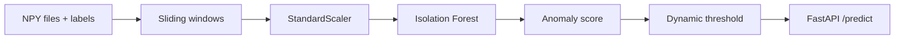

# Spacecraft Telemetry Anomaly Detection (SMAP)

Detect unusual behavior in NASA SMAP spacecraft sensor data using machine learning—without fixed rules like “alert if temperature > 50.”

This project learns what **normal** looks like from past telemetry, scores new data with an **Isolation Forest**, and raises alerts with a **dynamic threshold** (mean + n× standard deviation over recent scores).

---

## What problem does this solve?

Satellites send many sensor readings over time. A single value can be fine in one situation and dangerous in another.

Instead of hard limits, this pipeline:

1. Takes the **last 50 timesteps** of telemetry as one window (with context).
2. Trains on **normal training data only** (unsupervised).
3. Flags windows that look **unusual** compared to training.
4. Exposes results through a small **HTTP API**.

---

## How it works (simple flow)



| Step | What happens |
|------|----------------|
| **Data** | Channel files in `data/train/` and `data/test/` (`.npy`) |
| **Windows** | Last 50 timesteps per window (configurable in `config/smap.yaml`) |
| **Train** | Fit scaler + Isolation Forest → save to `artifacts/` |
| **Evaluate** | Compare predictions to labels (Point-Adjusted F1) |
| **Serve** | `POST /predict` returns score, threshold, and status |

On the **full Kaggle dataset**, each timestep has **25 sensors**, so one window = **50 × 25 = 1,250** numbers (flattened for the model).

---

## Tech stack

- Python 3.11+
- NumPy, pandas, scikit-learn
- FastAPI + uvicorn
- Docker / docker-compose (optional)

---

## Setup

```bash
cd spacecraft-anomaly-detection
python -m venv .venv
```

Activate the virtual environment:

- **Windows:** `.venv\Scripts\activate`
- **Linux/macOS:** `source .venv/bin/activate`

```bash
pip install -r requirements.txt
```

---

## Option A — Quick demo (synthetic data)

Use this to verify the pipeline runs in a few seconds. It creates one fake channel (`T-1`).

```bash
python scripts/generate_synthetic_data.py
python scripts/train.py
python scripts/evaluate.py
pytest -q
```

You should see **1 channel** in evaluation and very high scores (toy data).

> **Note:** `generate_synthetic_data.py` overwrites `data/labeled_anomalies.csv` with a tiny file. Do **not** run it after you set up full NASA data unless you want to go back to demo mode.

---

## Option B — Full NASA SMAP dataset

### 1. Download data

Install the [Kaggle CLI](https://www.kaggle.com/docs/api) and add your API key (`~/.kaggle/kaggle.json` on Linux/macOS, or `%USERPROFILE%\.kaggle\kaggle.json` on Windows).

```bash
pip install kaggle
```

Then download and prepare files:

```bash
# Linux/macOS
bash scripts/download_data.sh

# Windows PowerShell
.\scripts\download_data.ps1
```

Dataset: [NASA SMAP/MSL on Kaggle](https://www.kaggle.com/datasets/patrickfleith/nasa-anomaly-detection-dataset-smap-msl).

The download script copies `.npy` files into `data/train/` and `data/test/` and fetches the real `labeled_anomalies.csv` from Telemanom.

### 2. Train and evaluate

```bash
python scripts/train.py
python scripts/evaluate.py
```

Expected with full data:

- Training uses many channels (tens of thousands of windows).
- Evaluation reports about **53 SMAP channels** (channels need train + test files on disk).
- Macro **Point-Adjusted F1** is typically around **0.3–0.4** for this baseline (varies by run).

Channels missing local `.npy` files are skipped automatically.

### Restore labels if evaluation shows only 1 channel

If you see `Evaluating 1 SMAP channels...`, your labels file was overwritten by the synthetic demo. Restore it:

```bash
# PowerShell
Invoke-WebRequest -Uri "https://raw.githubusercontent.com/khundman/telemanom/master/labeled_anomalies.csv" -OutFile "data\labeled_anomalies.csv"
```

```bash
# Linux/macOS
curl -fsSL -o data/labeled_anomalies.csv https://raw.githubusercontent.com/khundman/telemanom/master/labeled_anomalies.csv
```

---

## Run the API

Train first so `artifacts/model.joblib` and `artifacts/scaler.joblib` exist.

```bash
uvicorn src.api.main:app --host 127.0.0.1 --port 8000
```

### Health check

```bash
curl http://127.0.0.1:8000/health
```

Example response:

```json
{"status": "ok"}
```

### Predict

Send recent telemetry as **`values`**. The API accepts:

| Training mode | `values` shape | Example size |
|---------------|----------------|--------------|
| **Synthetic** (demo) | 1D list of floats | 50 numbers |
| **Full SMAP** | 2D list: 50 timesteps × 25 sensors | 50 rows, 25 columns each |

**Full-data example** (50 timesteps × 25 features — shorten with `...` in real requests):

```bash
curl -X POST http://127.0.0.1:8000/predict \
  -H "Content-Type: application/json" \
  -d "{\"channel_id\": \"E-1\", \"values\": [[0.1, 0.2, ... 25 numbers ...], ... 50 rows ...], \"recent_scores\": [0.4, 0.42, 0.41]}"
```

Or send a **flat** 1D list of **1,250** numbers (50 × 25).

**Synthetic example** (after `generate_synthetic_data.py` + `train.py`):

```bash
curl -X POST http://127.0.0.1:8000/predict \
  -H "Content-Type: application/json" \
  -d "{\"channel_id\": \"T-1\", \"values\": [0.1, 0.2, 0.15, ... 50 floats total ...], \"recent_scores\": [0.4, 0.42, 0.41]}"
```

Example response:

```json
{
  "anomaly_score": 0.52,
  "threshold": 0.65,
  "status": "normal",
  "latency_ms": 8.5
}
```

- `status` is `normal` or `hardware_degradation`.
- Wrong input size returns **400** with a clear error (not 500).
- Target latency: **under 100 ms** per request (model loaded at startup).

---

## Deploy free on Hugging Face Spaces

**Space SDK: Docker** (not Gradio, not Static). This project is a FastAPI service.

1. Train on **full SMAP** locally (`download_data` → `train.py`).
2. Commit `artifacts/` to Git (`git add -f artifacts/...`).
3. Create a **Docker** Space (port **7860**) and connect the repo.

**Full guide:** [deploy/huggingface/DEPLOY.md](deploy/huggingface/DEPLOY.md)  
**Space README (paste on HF):** [deploy/huggingface/SPACE_README.md](deploy/huggingface/SPACE_README.md)

Quick test with Docker (same image as HF, port 7860):

```bash
docker build -t smap-hf .
docker run -p 7860:7860 smap-hf
curl http://127.0.0.1:7860/health
```

---

## Docker (optional)

Train (needs `data/` available in the container):

```bash
docker compose --profile train run --rm train
```

Run API:

```bash
docker compose up api
```

Artifacts are read from `./artifacts` — run training first.

---

## Evaluation metric (short)

**Point-Adjusted F1** (Telemanom protocol): if the model flags **any** point inside a true anomaly segment, the whole segment counts as detected. The script prints per-channel scores and a macro average.

---

## Project layout

| Path | Purpose |
|------|---------|
| `data/train`, `data/test` | Telemetry per channel (`.npy`) |
| `data/labeled_anomalies.csv` | Ground-truth anomaly intervals (evaluation) |
| `src/data/` | Load data, build windows, scaling |
| `src/models/` | Isolation Forest + dynamic threshold |
| `src/evaluation/` | Point-Adjusted F1 |
| `src/api/` | FastAPI `/health` and `/predict` |
| `scripts/train.py` | Train and save artifacts |
| `scripts/evaluate.py` | Evaluation report |
| `scripts/download_data.ps1` / `.sh` | Download full dataset |
| `scripts/generate_synthetic_data.py` | Tiny demo dataset |
| `config/smap.yaml` | Window size, threshold, model settings |
| `artifacts/` | Trained `model.joblib`, `scaler.joblib` |

---

## License

MIT — see [LICENSE](LICENSE).
